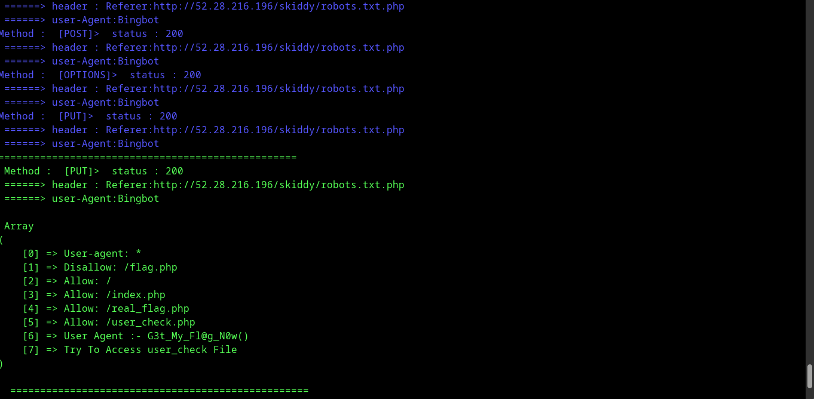

# bypass-403

## install 
```bash
git clone https://github.com/Archx1/bypass-403.git
```
```bash 
sudo pip install requests
```
```bash
sudo pip install os-sys
```
```bash
cd bypass-403 && sudo chmod +x bypass-403.py
```

```bash
python3 bypass-403.py
```
# It will create a file after we find the  bypass


